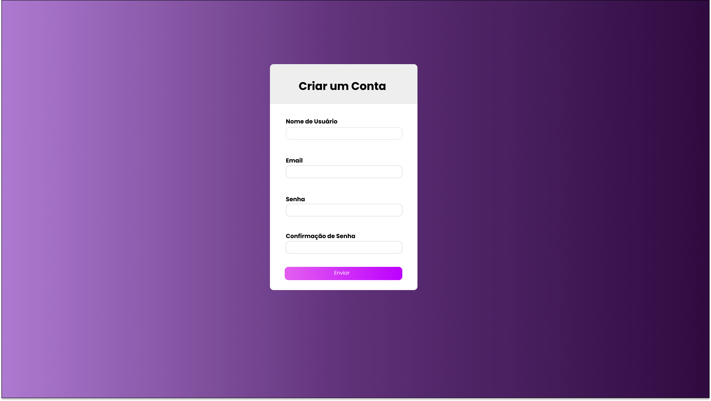

<h1 align="center"> Formulário </h1>

Student Project for pratice 

  <a href="#-technologies">Technologies</a>&nbsp;&nbsp;&nbsp;|&nbsp;&nbsp;&nbsp;
  <a href="#-project">Project</a>&nbsp;&nbsp;&nbsp;|&nbsp;&nbsp;&nbsp;

 

  

## 🚀 Technologies
This project was developed with the following technologies

- HTML e CSS
- SASS
- JavaScript
- Git e Github

## 💻 Project

Studant project used for practice my new knowledge in SASS and JavaScript.

- [Access the finalized project online](https://MatheusAmorimm.github.io/first-forms)

---
